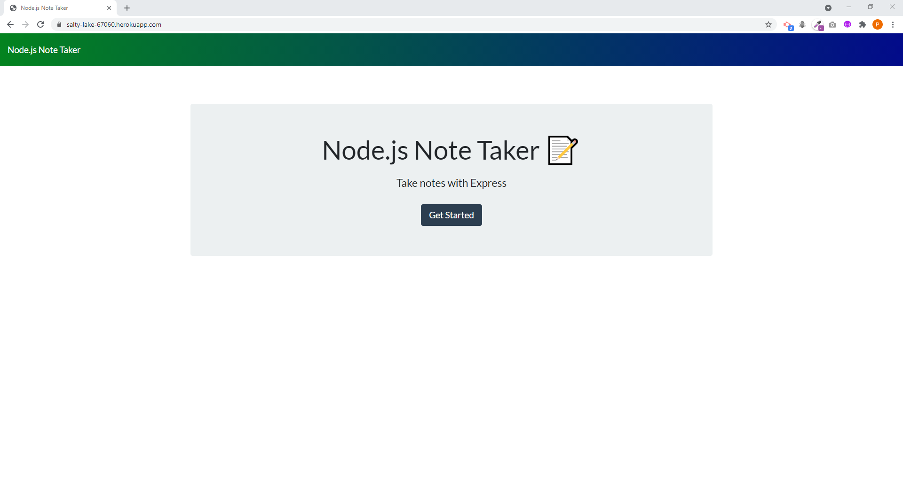
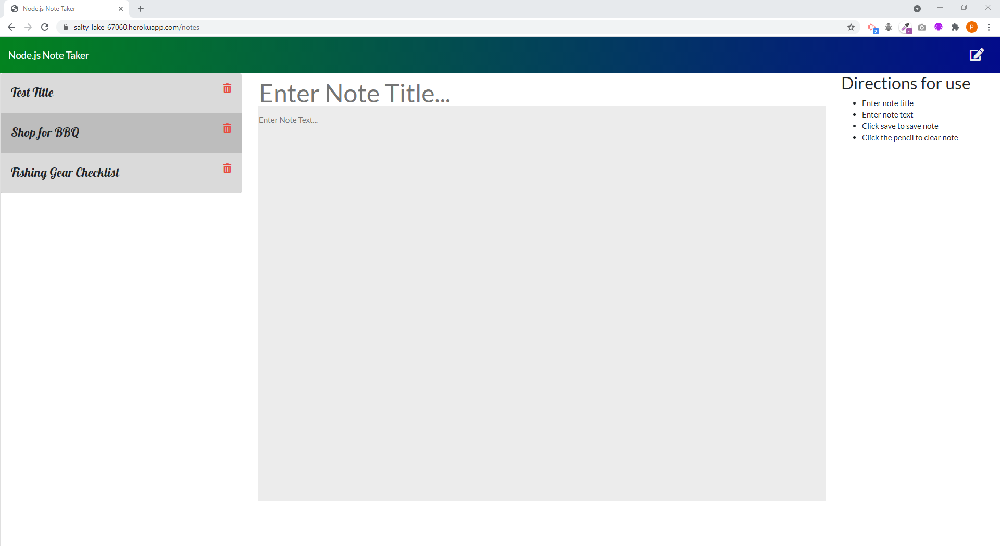

# __The NODE Note Taker__

## __Description__ 
 Create an application built using NODE.  The application is called Note Taker and it can be used to write and save notes. This application will use an Express.js back end and will save and retrieve note data from a JSON file.
## Table of Contents 
 - [User Story](#user-story) 
- [Acceptance Criteria](#acceptance-criteria) 
- [Installation](#installation) 
- [Usage](#usage) 
- [Required](#required) 
- [Testing](#testing) 
- [Questions And Support](#questions-and-support) 
- [Contributors](#contributors) 
- [Deployed Link](#deployed-link) 
- [Media Links](#media-links) 
- [License](#license) 

---
## __User__ __Story__ 
  AS A small business owner I WANT to be able to write and save notes SO THAT I can organize my thoughts and keep track of tasks I need to complete 
## __Acceptance__ __Criteria__ 
  GIVEN a note-taking application WHEN I open the Note Taker THEN I am presented with a landing page with a link to a notes page WHEN I click on the link to the notes page THEN I am presented with a page with existing notes listed in the left-hand column, plus empty fields to enter a new note title and the note’s text in the right-hand column WHEN I enter a new note title and the note’s text THEN a Save icon appears in the navigation at the top of the page WHEN I click on the Save icon THEN the new note I have entered is saved and appears in the left-hand column with the other existing notes WHEN I click on an existing note in the list in the left-hand column THEN that note appears in the right-hand column WHEN I click on the Write icon in the navigation at the top of the page THEN I am presented with empty fields to enter a new note title and the note’s text in the right-hand column   
## __Installation__ 
 + Steps to install + Install Node.js + Clone repository to your local machine + Run "npm install" to install all dependencies  
## __Usage__ 
  You will start the application by typing "npm start" in the command line. You should see the following message logged to the console: Server listening on PORT: 8080 Open you browser and type http://localhost:8080 in the address bar. You should now see the Node Note Taker landing page.  Follow the directions on the right to enter or delete notes.   
## __Media__ __Links__ 
  
  ## Landing Page  
    
   
  ## Note Management Page  
   
## __Required__ 
  The following NODE modules are required: Express UUID 
## __Testing__ 
  Testing was conducted to ensure the application met and ssatisfied the acceptance criteria.  
## __Questions__ __And__ __Support__ 
 If you have any questions about the application or the repository, please open an [issue](https://github.com/pmarceaujr/Node_Note_Taker/issues) or contact me via email at paul@marceaus.net.   
 You can find more of my work on my [GitHub](https://github.com/pmarceaujr).  
## __Contributors__ 
  No other contributors at this time.   
## __Deployed__ __Link__ 
  [Hosted on Heroku](https://pmarceaujr-node-notes-57eb5780f3c5.herokuapp.com/notes) 
## __License__ 
 This project is licensed under the [MIT License](https://choosealicense.com/licenses/mit).   
